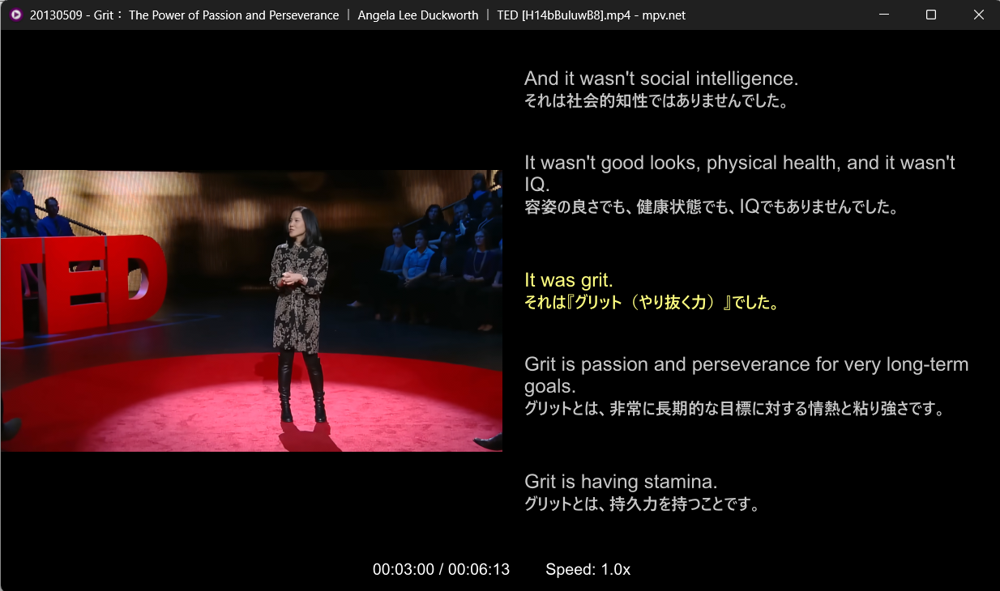
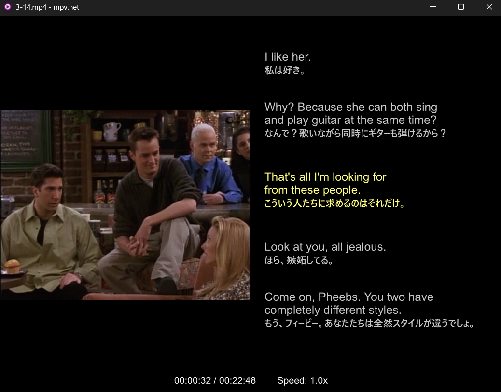

# mpv.net 英語学習用セット


## 目的
Windowsの動画再生プレイヤーmpv.netの設定です。


## スクリーンショット(mpv english learning pack)





## 初期レイアウト

- 動画 50%
- 字幕 50%
- 前2 / 現在 / 次2
- 現在字幕は色のみでハイライト
- `max_chars=55`

## キー / マウス操作

| 操作 | 動作 |
|---|---|
| 左クリック | 再生 / 一時停止 |
| Esc | 全画面を解除（通常表示中は何もしない） |
| ← | 5秒戻る |
| → | 5秒進む |
| ↑ | 10秒進む |
| ↓ | 10秒戻る |
| Shift + ← / → | 1秒戻る / 進む |
| Ctrl + ← | 前の字幕 |
| Ctrl + → | 次の字幕 |
| R | 現在字幕を先頭から再生 |
| S | 字幕パネル ON/OFF |
| `[` / `]` | 再生速度 -0.1 / +0.1 |
| Backspace | 速度を1.0xへ戻す |

## 常時ステータス表示

`portable_config/scripts/always-status.lua` が、

```text
現在時間 / 総時間        Speed: 現在速度
```

を画面最下部中央に表示します。

例:

```text
00:12:34 / 00:42:10        Speed: 1.0x
```


## 準備・配置

### 方法1: 設定済みパッケージを使う（簡単）

[Releasesページ](https://github.com/kuritaka/mpv.net_english_learning_pack/releases)からアーカイブをダウンロードして解凍し、`mpvnet.exe` を実行します。

### 方法2: mpv.netのポータブル版に設定を追加する

1. [mpv.netのReleasesページ](https://github.com/mpvnet-player/mpv.net/releases)から**portable版**をダウンロードして解凍します。
2. このリポジトリの `portable_config` ディレクトリを `mpvnet.exe` と同じ場所にコピーします。

`portable_config` を `mpvnet.exe` と同じ場所へ置きます。

```text
mpv.net/
├─ mpvnet.exe
└─ portable_config/
   ├─ mpv.conf
   ├─ input.conf
   ├─ scripts/
   │  ├─ english-subs.lua
   │  └─ always-status.lua
   └─ script-opts/
      └─ english-subs.conf
```


### 方法3: wingetでインストールする

PowerShellまたはコマンドプロンプトで、次を実行します。

```powershell
winget install --id mpv.net --exact
```

次に、このリポジトリの `portable_config` 内の**内容**を `%APPDATA%\mpv.net`（通常は `C:\Users\<ユーザー名>\AppData\Roaming\mpv.net`）へコピーします。

mpv.netは `mpvnet.exe` と同じ場所の `portable_config` を `%APPDATA%\mpv.net` より優先して読み込みます。このパックは、どちらか一方の場所だけに配置してください。

## 動画・字幕ファイルの準備

動画ファイルと外部字幕ファイルを同じフォルダに置きます。標準設定の `sub-auto=fuzzy` により、ファイル名が対応する `.srt` 字幕が自動で読み込まれます。

```text
lesson.mp4
lesson.en.srt
```
